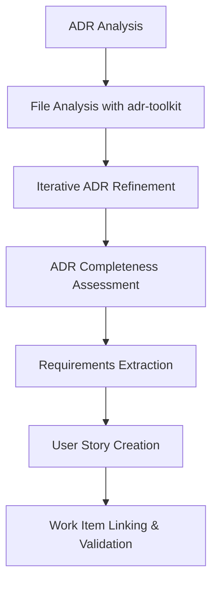

# ADR to Azure DevOps Work Items Conversion Process

## Overview

This document outlines the comprehensive process for converting Architectural Decision Records (ADRs) into structured Azure DevOps work items, specifically User Stories with proper formatting and hierarchical relationships.

## Process Flow



## Phase 1: Initial ADR Analysis

### 1.1 File Analysis with adr-toolkit

**Objective**: Extract technical requirements and implementation details from ADR documents.

**Tools Required**:
- adr-toolkit (for ADR analysis)
- Azure DevOps MCP Server tools
- PowerShell for secure authentication

**Steps**:
1. Locate ADR files in the project repository
2. Use adr-toolkit to analyze document structure and content
3. Extract key technical decisions and requirements
4. Identify implementation scenarios and acceptance criteria

**Example ADR Structure Analysis**:
```bash
# Analyze ADR content for technical requirements
adr-toolkit analyze --file "ADR-Update-User-Account-Change-Feed-Processing-Based-on-Sales-Skill.md"
```

### 1.2 Iterative ADR Refinement

**Objective**: Ensure ADR contains sufficient detail for implementation.

**Key Elements to Verify**:
- ✅ Clear problem statement
- ✅ Proposed solution with technical details
- ✅ Implementation scenarios (Given/When/Then)
- ✅ Acceptance criteria with measurable outcomes
- ✅ Story point estimates for complexity
- ✅ Dependencies and constraints

**Refinement Checklist**:
- [ ] Technical implementation details present
- [ ] Error handling scenarios defined
- [ ] Performance requirements specified
- [ ] Security considerations addressed
- [ ] Testing requirements outlined

## Phase 2: Azure Type and Flavor Development

### 2.1 Azure Function Type Determination

**Common Azure Function Types**:
- **HTTP Trigger**: Web API endpoints
- **Service Bus Trigger**: Message processing
- **Timer Trigger**: Scheduled tasks
- **Blob Trigger**: File processing
- **Event Grid Trigger**: Event-driven processing

**Flavor Considerations**:
- **Runtime Version**: .NET 6, .NET 8, Node.js, etc.
- **Hosting Plan**: Consumption, Premium, Dedicated
- **Scaling Requirements**: Based on load patterns
- **Integration Points**: CRM, databases, external APIs

### 2.2 Existing .csproj File Integration

**Analysis Steps**:
1. Examine existing project structure
2. Identify current dependencies and packages
3. Assess compatibility with proposed changes
4. Plan incremental implementation approach

**Key Integration Points**:
```xml
<!-- Example .csproj modifications -->
<PackageReference Include="Microsoft.Azure.Functions.Worker" Version="1.19.0" />
<PackageReference Include="Microsoft.Azure.Functions.Worker.Sdk" Version="1.16.4" />
<PackageReference Include="Microsoft.Azure.WebJobs.Extensions.ServiceBus" Version="5.12.0" />
```

## Phase 3: Recommended Workflow

### 3.1 Development Environment Setup

**Prerequisites**:
- Azure DevOps project access
- Personal Access Token (PAT) with work item permissions
- Azure CLI or Azure DevOps CLI installed
- PowerShell for automation scripts

**Secure Authentication Setup**:
```powershell
# Secure PAT handling script
param(
    [string]$WorkItemId,
    [string]$FilePath
)

# Retrieve PAT securely (environment variable, credential manager, or prompt)
$pat = Get-PersonalAccessToken
```

### 3.2 ADR Completeness Assessment

**Readiness Criteria**:
- [ ] ADR contains specific technical requirements
- [ ] Implementation scenarios are detailed
- [ ] Acceptance criteria are measurable
- [ ] Dependencies are identified
- [ ] Story points estimated
- [ ] Error handling defined

**Assessment Questions**:
- Can the development team implement without additional clarification?
- Are acceptance criteria testable?
- Is the scope clearly defined?
- Are performance requirements specified?

### 3.3 Requirements Flavor Creation

**Requirements Structure**:
```markdown
## User Story: [Title]

**As a** [user role]
**I want to** [functionality]
**So that** [business value]

### Scenarios
#### Scenario 1: [Name]
- **Given** [context]
- **When** [action]
- **Then** [expected outcome]

### Acceptance Criteria
#### Functional Requirements
1. **Requirement 1**
   - Sub-requirement details
   - Implementation specifics

#### Non-Functional Requirements
1. **Performance**
   - Specific metrics and targets
```

## Phase 4: User Story Creation Process

### 4.1 Work Item Creation Strategy

**Important**: Due to Azure DevOps markdown formatting limitations, use this approach:

1. **Create User Story with minimal fields**:
   - Title only + required custom fields
   - Skip Description and Acceptance Criteria initially

2. **Manual Markdown Editor Activation**:
   - Open work item in Azure DevOps UI
   - Click markdown icon (📝) for Description field
   - Click markdown icon (📝) for Acceptance Criteria field
   - Paste formatted content

3. **API Population** (Alternative):
   - Use HTML-formatted content that renders as markdown
   - Update fields programmatically after manual format selection

### 4.2 Required Custom Fields

**Standard Fields**:
- `System.Title`: User Story title
- `System.Description`: Detailed requirements (markdown)
- `Microsoft.VSTS.Common.AcceptanceCriteria`: Acceptance criteria (markdown)
- `Microsoft.VSTS.Scheduling.StoryPoints`: Complexity estimate

**Project-Specific Custom Fields**:
```json
{
  "Custom.InvestigationStory": "false",
  "Custom.Demo": "false",
  "Custom.IndustrialTargetRelease": "Yet To be Decided",
  "Custom.ComponentsAdded": "true"
}
```

### 4.3 Hierarchical Linking

**Work Item Relationships**:
```
Epic
├── Feature
    ├── Requirement (ADR attached)
        ├── User Story 1 (5 points)
        ├── User Story 2 (2 points)
        ├── User Story 3 (2 points)
        ├── User Story 4 (1 point)
        └── User Story 5 (1 point)
```

**Linking Process**:
```powershell
# Link User Story to parent Requirement
$linkParams = @{
    project = "Dynamics 365 Convergence"
    updates = @(
        @{
            id = $userStoryId
            linkToId = $requirementId
            type = "parent"
        }
    )
}
```

## Phase 5: Validation and Quality Assurance

### 5.1 Work Item Validation

**Checklist**:
- [ ] All required fields populated
- [ ] Markdown formatting renders correctly
- [ ] Parent-child relationships established
- [ ] Story points assigned
- [ ] Acceptance criteria are testable
- [ ] Technical details sufficient for implementation

### 5.2 Process Metrics

**Track These Metrics**:
- ADR analysis time
- User story creation time
- Format correction iterations
- Implementation alignment accuracy
- Development team feedback

## Best Practices

### 6.1 ADR Preparation
- Ensure ADR contains implementation-ready details
- Include specific technical requirements
- Define clear acceptance criteria
- Estimate complexity with story points

### 6.2 Work Item Management
- Use consistent naming conventions
- Maintain hierarchical relationships
- Include comprehensive acceptance criteria
- Link related work items appropriately

### 6.3 Process Optimization
- Create templates for common scenarios
- Automate repetitive tasks where possible
- Maintain process documentation
- Gather feedback for continuous improvement

## Tools and Automation

### 7.1 Required Tools
- Azure DevOps MCP Server
- PowerShell for automation
- adr-toolkit for analysis
- Azure CLI for work item management

### 7.2 Automation Opportunities
- PAT secure retrieval scripts
- Work item creation templates
- Validation checklists
- Bulk linking operations

## Troubleshooting

### 8.1 Common Issues

**Markdown Formatting Issues**:
- Solution: Create work item first, then manually enable markdown editor

**Custom Field Validation Errors**:
- Solution: Ensure all required custom fields are included with valid values

**Authentication Failures**:
- Solution: Use secure PAT handling with environment variables or credential manager

**Work Item Linking Problems**:
- Solution: Verify work item IDs and relationship types

## Conclusion

This process provides a structured approach to converting ADR content into actionable Azure DevOps work items. The key insight is that manual markdown editor activation in the Azure DevOps UI provides the most reliable formatting control, despite requiring an additional step in the workflow.

**Key Success Factors**:
- Comprehensive ADR preparation
- Manual markdown editor activation
- Proper hierarchical linking
- Consistent field population
- Regular process validation

This methodology ensures that technical requirements are properly captured, formatted, and linked for efficient development execution.