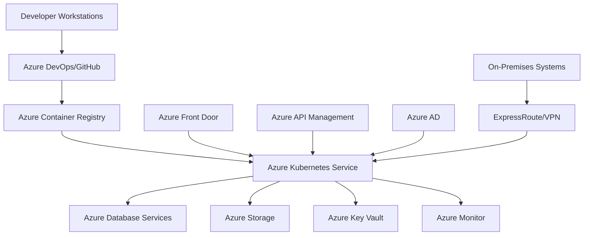

# Azure Kubernetes Service Technical Deep-Dive Analysis

## Executive Summary

### Solution Overview

[Provide a high-level overview of the Azure Kubernetes Service solution architecture, key components, and business value proposition]

### Key Technical Decisions

- **Cluster Configuration**: Single-tenant vs multi-tenant, regional distribution, and node pool strategies
- **Networking Model**: Kubenet vs Azure CNI, network policies, and service mesh integration
- **Security Framework**: Pod security standards, network policies, and Azure AD integration
- **Monitoring Strategy**: Azure Monitor integration, Prometheus, and Grafana for observability
- **CI/CD Pipeline**: GitOps implementation, Helm charts, and deployment automation

### Success Metrics

- **Deployment Velocity**: Container deployment time reduced by 80%
- **Operational Efficiency**: Infrastructure management overhead reduced by 60%
- **Application Availability**: 99.9% uptime for containerized workloads
- **Cost Optimization**: Container resource utilization improved by 40%

## Technical Architecture

### System Context Diagram

### Cluster Architecture

#### Node Pool Design

- **System Node Pools**: Dedicated pools for Kubernetes system components
- **User Node Pools**: Application workload isolation and resource optimization
- **Spot Node Pools**: Cost optimization using Azure Spot VMs
- **GPU Node Pools**: Specialized pools for AI/ML workloads

#### Storage Architecture

- **Persistent Volumes**: Azure Disk, Azure Files, and Azure Blob storage integration
- **Storage Classes**: Performance tiers, backup policies, and data protection
- **CSI Drivers**: Container Storage Interface for cloud-native storage management
- **Backup Solutions**: Velero integration for cluster and application backups

### Security Architecture

#### Identity and Access Management

- **Azure AD Integration**: Kubernetes RBAC with Azure AD authentication
- **Service Principals**: Application authentication and resource access
- **Managed Identities**: Secure authentication without credential management
- **Pod Identity**: Workload identity for Azure resource access

#### Network Security

- **Network Policies**: Kubernetes network policies for pod-to-pod communication
- **Azure Firewall**: Network-level security and traffic filtering
- **Private Clusters**: No public IP exposure for enhanced security
- **Service Mesh**: Istio/Linkerd integration for advanced traffic management

## Integration Architecture

### Application Integration Patterns

#### Microservices Communication

- **Service Discovery**: Kubernetes DNS and service mesh for service-to-service communication
- **API Gateway**: Azure Application Gateway or API Management for external access
- **Event-Driven Architecture**: Event Grid integration for asynchronous communication
- **Message Queues**: Service Bus integration for reliable messaging

#### External System Integration

- **Database Integration**: Secure connectivity to Azure databases and external systems
- **Legacy System Integration**: Hybrid connectivity patterns for on-premises systems
- **Third-Party Services**: Integration with SaaS platforms and external APIs
- **Multi-Cloud Integration**: Cross-cloud connectivity and workload portability

### DevOps Integration

#### CI/CD Pipeline Integration

- **Azure DevOps**: Complete CI/CD pipelines with Kubernetes deployments
- **GitHub Actions**: GitOps workflows and automated deployments
- **Helm Charts**: Package management and application templating
- **Kustomize**: Kubernetes native configuration management

## Performance Architecture

### Resource Management

#### Pod Resource Management

- **Resource Requests/Limits**: CPU and memory allocation for predictable performance
- **Horizontal Pod Autoscaling**: Automatic scaling based on resource utilization
- **Vertical Pod Autoscaling**: Dynamic resource adjustment for optimal performance
- **Cluster Autoscaling**: Node pool scaling based on workload demands

#### Application Performance

- **Service Mesh Optimization**: Traffic routing and load balancing optimization
- **Caching Strategies**: Redis integration and application-level caching
- **Database Connection Pooling**: Efficient database connection management
- **CDN Integration**: Azure CDN for static content delivery

### Scalability Considerations

#### Horizontal Scaling

- **Pod Autoscaling**: HPA configuration for application scaling
- **Cluster Autoscaling**: AKS cluster autoscaler for infrastructure scaling
- **Multi-Region Deployment**: Geo-distribution for global scalability
- **Load Balancing**: Azure Load Balancer and Ingress controller optimization

#### Performance Monitoring

- **Application Metrics**: Custom metrics and performance monitoring
- **Infrastructure Metrics**: Node and cluster performance tracking
- **Service Level Objectives**: SLO definition and monitoring
- **Performance Baselines**: Establishing performance benchmarks

## Monitoring and Observability

### Azure Monitor Integration

#### Metrics Collection

- **Cluster Metrics**: Node health, pod status, and resource utilization
- **Application Metrics**: Custom application performance metrics
- **Network Metrics**: Traffic patterns and connectivity monitoring
- **Security Metrics**: Threat detection and security event monitoring

#### Alerting Configuration

- **Health Alerts**: Pod crashes, node failures, and resource exhaustion
- **Performance Alerts**: Response time degradation and throughput issues
- **Security Alerts**: Unauthorized access attempts and policy violations
- **Capacity Alerts**: Resource utilization thresholds and scaling events

### Logging and Diagnostics

#### Centralized Logging

- **Azure Monitor Logs**: Comprehensive logging for cluster and applications
- **Application Logs**: Structured logging and log aggregation
- **Audit Logs**: Security and compliance auditing
- **Performance Logs**: Detailed performance and troubleshooting data

#### Observability Tools

- **Prometheus**: Metrics collection and alerting
- **Grafana**: Visualization and dashboard creation
- **Jaeger**: Distributed tracing for microservices
- **Kiali**: Service mesh observability and traffic management

## Security Implementation

### Container Security

#### Image Security

- **Azure Container Registry**: Secure image storage and scanning
- **Image Vulnerability Scanning**: Automated security scanning and patching
- **Image Signing**: Digital signatures for image integrity verification
- **Admission Controllers**: Policy enforcement for container deployment

#### Runtime Security

- **Pod Security Standards**: Security contexts and privilege escalation prevention
- **Network Policies**: Pod-to-pod communication controls
- **Secrets Management**: Azure Key Vault integration for sensitive data
- **Security Monitoring**: Runtime threat detection and response

### Compliance and Governance

#### Regulatory Compliance

- **GDPR Compliance**: Data protection and privacy controls
- **HIPAA Compliance**: Healthcare data protection requirements
- **PCI DSS**: Payment card industry security standards
- **SOX Compliance**: Financial reporting and audit requirements

#### Governance Framework

- **Policy as Code**: OPA Gatekeeper for policy enforcement
- **Configuration Management**: GitOps for infrastructure and application governance
- **Audit and Compliance**: Automated compliance monitoring and reporting
- **Change Management**: Controlled deployment and change approval processes

## Deployment and Operations

### Infrastructure as Code

#### ARM/Bicep Templates

- **Cluster Deployment**: Automated AKS cluster provisioning
- **Network Configuration**: VNet, subnets, and network security setup
- **Security Configuration**: Azure AD, RBAC, and security policies
- **Monitoring Setup**: Azure Monitor and observability configuration

#### GitOps Implementation

- **Flux CD**: GitOps operator for continuous deployment
- **ArgoCD**: Declarative continuous delivery
- **Helm**: Package management and application deployment
- **Kustomize**: Kubernetes native configuration customization

### Operational Procedures

#### Cluster Management

- **Version Management**: Kubernetes version upgrades and patch management
- **Node Pool Operations**: Scaling, upgrading, and maintenance operations
- **Backup and Recovery**: Cluster backup and disaster recovery procedures
- **Capacity Planning**: Resource forecasting and capacity management

#### Application Operations

- **Deployment Strategies**: Rolling updates, blue-green, and canary deployments
- **Health Checks**: Liveness, readiness, and startup probes
- **Resource Management**: Resource quotas and limit ranges
- **Troubleshooting**: Debugging tools and diagnostic procedures

## Backup and Recovery

### Backup Strategy

#### Application Backup

- **Velero Integration**: Kubernetes-native backup and restore
- **Azure Backup**: Integration with Azure Backup services
- **Database Backups**: Application data backup and recovery
- **Configuration Backup**: Kubernetes configuration and secrets backup

#### Disaster Recovery

- **Multi-Region Deployment**: Cross-region replication and failover
- **Cluster Backup**: Complete cluster state backup and recovery
- **Application Recovery**: Application-specific recovery procedures
- **Data Recovery**: Persistent volume and database recovery

### Recovery Procedures

#### Business Continuity

- **RTO/RPO Definition**: Recovery time and point objectives
- **Failover Procedures**: Automated and manual failover processes
- **Communication Plans**: Stakeholder communication during incidents
- **Testing Procedures**: Regular DR testing and validation

## Cost Optimization

### Node Pool Optimization

- **Right-Sizing**: Appropriate VM sizes for workload requirements
- **Spot Instances**: Cost-effective spot VM utilization
- **Auto-Scaling**: Dynamic scaling to match workload demands
- **Workload Placement**: Intelligent pod scheduling and resource allocation

#### Cost Monitoring

- **Azure Cost Management**: Cost tracking and optimization recommendations
- **Resource Utilization**: CPU, memory, and storage utilization analysis
- **Cost Allocation**: Cost tagging and chargeback mechanisms
- **Budget Controls**: Cost thresholds and alerting

### Optimization Strategies

#### Application Optimization

- **Resource Efficiency**: Optimal resource requests and limits
- **Storage Optimization**: Efficient storage utilization and tiering
- **Network Optimization**: Traffic optimization and CDN integration
- **Caching Strategies**: Application and data caching for performance

## Migration Strategy

### Assessment and Planning

#### Current State Analysis

- **Application Inventory**: Containerization candidates and migration complexity
- **Dependency Analysis**: Application dependencies and integration points
- **Performance Baseline**: Current performance metrics and requirements
- **Security Assessment**: Current security posture and compliance requirements

#### Migration Planning

- **Migration Approach**: Lift-and-shift, refactor, or rebuild strategies
- **Containerization Strategy**: Application modernization and container adoption
- **Testing Strategy**: Migration testing and validation procedures
- **Rollback Planning**: Migration rollback procedures and risk mitigation

### Implementation Phases

#### Phase 1: Foundation

- **AKS Environment Setup**: Cluster provisioning and configuration
- **CI/CD Pipeline Setup**: Deployment pipeline and automation
- **Security Configuration**: Security policies and access controls
- **Monitoring Setup**: Observability and monitoring configuration

#### Phase 2: Migration

- **Application Containerization**: Application packaging and containerization
- **Database Migration**: Database migration and connectivity setup
- **Integration Migration**: External system integration and testing
- **Performance Validation**: Performance testing and optimization

#### Phase 3: Optimization

- **Security Hardening**: Advanced security implementation and validation
- **Performance Tuning**: Application and infrastructure optimization
- **Cost Optimization**: Resource optimization and cost management
- **Documentation**: Migration documentation and knowledge transfer

## Future Considerations

### Technology Roadmap

#### Platform Evolution

- **Kubernetes Upgrades**: Adoption of latest Kubernetes features and capabilities
- **Service Mesh Maturity**: Advanced service mesh capabilities and integration
- **GitOps Advancement**: Enhanced GitOps workflows and automation
- **Multi-Cluster Management**: Multi-cluster and multi-cloud management

#### Application Modernization

- **Microservices Evolution**: Further decomposition and service mesh adoption
- **Event-Driven Architecture**: Event-driven patterns and serverless integration
- **AI/ML Integration**: Machine learning capabilities and model deployment
- **IoT Integration**: IoT data processing and edge computing

### Operational Excellence

#### Automation and DevOps

- **Infrastructure Automation**: Complete infrastructure as code adoption
- **CI/CD Maturity**: Advanced deployment strategies and release management
- **Observability Enhancement**: Comprehensive observability and monitoring
- **Site Reliability Engineering**: SRE practices and reliability engineering

#### Team Development

- **Skills Development**: Kubernetes and cloud-native skills training
- **Knowledge Management**: Documentation and knowledge sharing platforms
- **Collaboration Tools**: Enhanced collaboration and communication tools
- **Continuous Learning**: Ongoing learning and certification programs

## Risk Mitigation

### Technical Risks

#### Performance Risks

- **Resource Contention**: Implement resource quotas and horizontal pod autoscaling
- **Network Performance**: Optimize network configuration and service mesh
- **Storage Performance**: Implement appropriate storage classes and optimization
- **Application Performance**: Performance monitoring and optimization strategies

#### Security Risks

- **Container Vulnerabilities**: Implement image scanning and admission controllers
- **Network Security**: Network policies and service mesh security
- **Access Management**: RBAC and Azure AD integration
- **Data Protection**: Secrets management and encryption

### Operational Risks

#### Availability Risks

- **Cluster Availability**: Multi-zone deployment and cluster autoscaling
- **Application Availability**: Health checks and pod disruption budgets
- **Network Availability**: Network redundancy and failover strategies
- **Data Availability**: Backup and disaster recovery procedures

#### Cost Risks

- **Cost Overruns**: Cost monitoring and resource optimization
- **Resource Waste**: Auto-scaling and workload right-sizing
- **Unexpected Charges**: Cost analysis and budget controls
- **Vendor Lock-in**: Multi-cloud strategies and portability

## Success Metrics and KPIs

### Performance Metrics

- **Deployment Frequency**: Multiple deployments per day
- **Lead Time for Changes**: Minutes to hours for deployment
- **Change Failure Rate**: < 5% deployment failures
- **Time to Restore Service**: < 15 minutes for critical incidents

### Operational Metrics

- **Cluster Uptime**: 99.9% cluster availability
- **Resource Utilization**: 70-80% average resource utilization
- **MTTR**: < 30 minutes mean time to resolution
- **Automation Rate**: 90% of operational tasks automated

### Business Metrics

- **Development Velocity**: 50% faster feature delivery
- **Operational Efficiency**: 60% reduction in infrastructure management
- **Cost Optimization**: 40% reduction in infrastructure costs
- **User Satisfaction**: > 90% developer satisfaction

## Conclusion

### Key Achievements

[Summarize the successful implementation of Azure Kubernetes Service solution and achieved benefits]

### Lessons Learned

[Document key lessons learned during the implementation and operational phases]

### Next Steps

[Outline immediate next steps and long-term roadmap for the solution evolution]

### Recommendations

[Provide final recommendations for ongoing optimization and future enhancements]
