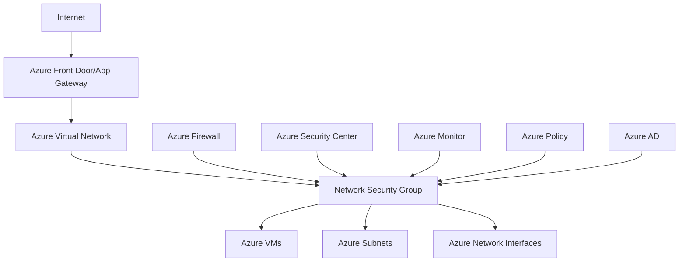

# Azure Network Security Group Technical Deep-Dive Analysis

## Executive Summary

### Solution Overview

[Provide a high-level overview of the Azure Network Security Group solution architecture, key components, and business value proposition]

### Key Technical Decisions

- **Security Model**: Traditional NSG vs Application Security Groups vs Service Tags
- **Rule Design**: Allow vs Deny rules, rule prioritization, and default security rules
- **Monitoring Strategy**: Azure Monitor integration, security analytics, and threat intelligence
- **Automation Approach**: Infrastructure as code, policy-driven security, and automated remediation

### Success Metrics

- **Security Effectiveness**: Threat detection rate and false positive reduction
- **Network Performance**: Latency impact and throughput maintenance
- **Operational Efficiency**: Security policy deployment time and incident response
- **Compliance Coverage**: Regulatory requirements met and audit success rate

## Technical Architecture

### System Context Diagram

### Security Architecture

#### NSG Design Principles

- **Zero Trust Model**: Never trust, always verify network communications
- **Defense in Depth**: Multiple security layers protecting network resources
- **Least Privilege**: Minimal required access for network communications
- **Micro-Segmentation**: Network isolation at subnet and resource levels

#### Rule Architecture

- **Rule Prioritization**: Numbered rules (100-4096) with lower numbers taking precedence
- **Rule Components**: Source/destination, ports, protocols, and actions (Allow/Deny)
- **Default Rules**: Built-in security rules for baseline protection
- **Custom Rules**: Application-specific security policies and access controls

### Security Implementation Details

#### Authentication and Authorization

- **Azure AD Integration**: Role-based access control for NSG management
- **Resource Locks**: Prevent accidental modification of critical security rules
- **Privileged Identity Management**: Just-in-time access for security administration
- **Audit Logging**: Comprehensive logging of all NSG configuration changes

#### Network Protection

- **Traffic Filtering**: Stateful inspection of inbound and outbound traffic
- **Protocol Support**: TCP, UDP, ICMP, and custom protocol filtering
- **Port Management**: Dynamic port allocation and service-specific port controls
- **IP Address Management**: Support for individual IPs, ranges, and service tags

### High Availability and Disaster Recovery

#### Availability Configuration

- **Regional Resilience**: NSG availability within Azure regions
- **Cross-Region Protection**: Geo-redundant security policies and configurations
- **Failover Scenarios**: Security policy continuity during regional failures
- **Service-Level Agreements**: 99.9% availability for NSG service operations

#### Disaster Recovery Strategy

- **Configuration Backup**: Automated backup of NSG configurations and rules
- **Policy Replication**: Cross-region replication of security policies
- **Failover Procedures**: Automated failover of security configurations
- **Recovery Testing**: Regular testing of security configuration recovery

## Integration Architecture

### Application Integration Patterns

#### Security Policy Integration

- **Infrastructure as Code**: NSG configuration through ARM templates and Bicep
- **Policy-Driven Security**: Azure Policy integration for automated rule management
- **Application Security Groups**: Dynamic grouping of resources for security policies
- **Service Tags**: Pre-defined tags for Azure service access management

#### Network Integration

- **Virtual Network Integration**: NSG association with VNets, subnets, and NICs
- **Hub-and-Spoke Architecture**: Centralized security policies for distributed networks
- **Peering Integration**: Security policies across peered virtual networks
- **ExpressRoute Integration**: On-premises connectivity security and access control

### System Integration

#### Security Ecosystem Integration

- **Azure Security Center**: Integrated threat detection and security recommendations
- **Azure Firewall**: Next-generation firewall integration and policy coordination
- **Azure Sentinel**: SIEM integration for advanced threat hunting and analytics
- **Third-Party Security Tools**: Integration with existing security monitoring platforms

#### DevOps Integration

- **CI/CD Pipeline Integration**: Automated security testing and policy validation
- **Configuration Management**: Infrastructure as code for security configuration
- **Automated Testing**: Security regression testing and compliance validation
- **Deployment Automation**: Automated NSG deployment and configuration updates

## Performance Architecture

### Network Optimization

#### Traffic Flow Optimization

- **Rule Processing**: Efficient rule evaluation and traffic filtering
- **Connection Tracking**: Stateful connection management and optimization
- **Throughput Optimization**: High-throughput traffic processing capabilities
- **Latency Minimization**: Low-latency security rule processing

#### Scalability Considerations

- **Rule Limits**: Management of 1000 rules per NSG with optimal performance
- **Resource Scaling**: NSG scaling with network traffic and resource growth
- **Concurrent Connections**: Support for high-volume concurrent network connections
- **Performance Monitoring**: Continuous monitoring of security performance metrics

### Security Performance

#### Threat Detection Performance

- **Real-Time Analysis**: Real-time threat detection and alerting capabilities
- **False Positive Reduction**: Advanced filtering to minimize false security alerts
- **Automated Response**: Automated threat response and mitigation actions
- **Performance Baselines**: Established performance benchmarks for security operations

## Monitoring and Observability

### Azure Monitor Integration

#### Security Metrics Collection

- **Traffic Metrics**: Network traffic patterns, allowed/blocked connections, and throughput
- **Security Events**: Security rule hits, threat detections, and policy violations
- **Performance Metrics**: Rule processing latency, connection tracking, and resource utilization
- **Compliance Metrics**: Security policy compliance and configuration drift detection

#### Alerting Configuration

- **Security Alerts**: Unauthorized access attempts, suspicious traffic patterns, and policy violations
- **Performance Alerts**: Rule processing delays, throughput degradation, and resource exhaustion
- **Compliance Alerts**: Configuration drift, policy violations, and compliance gaps
- **Operational Alerts**: NSG service issues, connectivity problems, and maintenance notifications

### Logging and Diagnostics

#### Security Audit Logging

- **NSG Flow Logs**: Detailed logging of allowed and denied network traffic
- **Activity Logs**: Administrative operations and configuration changes
- **Diagnostic Logs**: Detailed security event logging and analysis
- **Custom Logging**: Application-specific security logging and telemetry

#### Security Analytics

- **Traffic Analysis**: Network traffic pattern analysis and anomaly detection
- **Threat Intelligence**: Integration with threat intelligence feeds and indicators
- **Compliance Reporting**: Automated compliance reporting and audit trail generation
- **Forensic Analysis**: Detailed investigation capabilities for security incidents

## Security Implementation

### Identity and Access Management

#### Authentication Methods

- **Azure AD Authentication**: Integrated authentication with Azure Active Directory
- **Multi-Factor Authentication**: Enhanced security for privileged security operations
- **Service Principals**: Automated authentication for security tools and services
- **Certificate-Based Authentication**: Certificate-based authentication for secure access

#### Authorization Model

- **RBAC Roles**: Built-in roles for NSG management and security operations
- **Custom Roles**: Organization-specific roles for security administration
- **Privileged Access**: Just-in-time access and approval workflows
- **Access Reviews**: Regular review and certification of security access permissions

### Network Security Controls

#### Traffic Control Implementation

- **Inbound Security**: Protection against unauthorized inbound network access
- **Outbound Security**: Control and monitoring of outbound network communications
- **Lateral Movement Prevention**: Network segmentation to prevent lateral movement
- **Service Access Control**: Controlled access to Azure platform services

#### Advanced Security Features

- **Distributed Denial of Service Protection**: DDoS protection integration and coordination
- **Web Application Firewall**: WAF integration for application-layer protection
- **Network Intrusion Detection**: Advanced threat detection and prevention
- **Zero Trust Networking**: Continuous verification and least-privilege access

## Deployment and Operations

### Infrastructure as Code

#### ARM Templates

- **NSG Deployment**: Automated NSG provisioning and configuration
- **Rule Configuration**: Declarative security rule definitions and management
- **Association Management**: Automated association with networks and resources
- **Policy Integration**: Integration with Azure Policy for governance

#### CI/CD Integration

- **Security Testing**: Automated security rule validation and testing
- **Configuration Deployment**: Automated deployment of security configurations
- **Compliance Validation**: Automated compliance checking and reporting
- **Rollback Procedures**: Automated rollback for security configuration issues

### Operational Procedures

#### Security Operations

- **Rule Management**: Regular review and optimization of security rules
- **Threat Response**: Incident response procedures and coordination
- **Compliance Monitoring**: Continuous compliance monitoring and reporting
- **Performance Optimization**: Regular optimization of security configurations

#### Incident Response

- **Security Monitoring**: 24/7 security monitoring and alerting
- **Incident Investigation**: Detailed investigation procedures for security events
- **Containment Strategies**: Rapid containment of security incidents
- **Recovery Procedures**: Security configuration recovery and restoration

## Backup and Recovery

### Configuration Protection

#### Security Configuration Backup

- **Rule Backup**: Automated backup of NSG rules and configurations
- **Policy Backup**: Backup of associated security policies and settings
- **Version Control**: Versioned security configurations for rollback capabilities
- **Configuration Validation**: Automated validation of backup integrity

#### Recovery Procedures

#### Configuration Recovery

- **Rule Restoration**: Automated restoration of security rules and configurations
- **Policy Recovery**: Recovery of security policies and associated settings
- **Version Rollback**: Rollback to previous security configuration versions
- **Validation Testing**: Testing and validation of recovered configurations

## Cost Optimization

### Resource Sizing

#### Security Resource Optimization

- **Rule Efficiency**: Optimization of security rules for performance and cost
- **Monitoring Optimization**: Cost-effective security monitoring and logging
- **Resource Utilization**: Optimal utilization of NSG resources and capabilities
- **Cost Monitoring**: Continuous monitoring of security-related costs

#### Cost Management

- **Budget Optimization**: Cost-effective security implementation within budget constraints
- **Resource Tagging**: Proper tagging for security resource cost allocation
- **Usage Optimization**: Optimization of security service usage and consumption
- **Cost Analysis**: Regular analysis of security costs and optimization opportunities

### Optimization Strategies

#### Security Efficiency

- **Rule Consolidation**: Consolidation of redundant security rules
- **Policy Optimization**: Optimization of security policies for efficiency
- **Automation Benefits**: Cost benefits of automated security operations
- **Resource Optimization**: Optimal resource allocation for security services

## Compliance and Governance

### Regulatory Compliance

#### Security Standards

- **NIST Compliance**: Compliance with NIST cybersecurity frameworks
- **ISO 27001**: Information security management system compliance
- **PCI DSS**: Payment card industry security standards compliance
- **Industry Regulations**: Compliance with industry-specific security requirements

#### Audit and Reporting

- **Security Audits**: Regular security audits and compliance assessments
- **Audit Trails**: Comprehensive audit trails for security operations
- **Compliance Reporting**: Automated compliance reporting and documentation
- **Regulatory Submissions**: Preparation of regulatory compliance submissions

### Governance Framework

#### Security Governance

- **Policy Management**: Centralized security policy management and enforcement
- **Change Control**: Security change control and approval processes
- **Risk Management**: Security risk assessment and mitigation strategies
- **Continuous Improvement**: Ongoing improvement of security posture and capabilities

## Migration Strategy

### Assessment and Planning

#### Current State Analysis

- **Security Assessment**: Current network security posture and capabilities
- **Architecture Review**: Existing network architecture and security controls
- **Compliance Status**: Current compliance status and regulatory requirements
- **Risk Assessment**: Security risks and vulnerabilities in current environment

#### Migration Planning

- **Security Model Migration**: Migration from traditional to cloud-native security models
- **Rule Migration**: Migration and optimization of existing security rules
- **Integration Planning**: Planning for integration with Azure security services
- **Testing Strategy**: Security testing and validation procedures

### Implementation Phases

#### Phase 1: Foundation

- **Azure Environment Setup**: Azure networking and security environment setup
- **Security Baseline**: Establishment of security baseline configurations
- **Integration Setup**: Setup of integration with existing security tools
- **Testing Environment**: Creation of testing environment for security validation

#### Phase 2: Migration

- **Rule Migration**: Migration of security rules to Azure NSG
- **Configuration Deployment**: Deployment of NSG configurations and associations
- **Integration Testing**: Testing of security integrations and functionality
- **Performance Validation**: Validation of security performance and effectiveness

#### Phase 3: Optimization

- **Security Optimization**: Optimization of security configurations and rules
- **Monitoring Implementation**: Implementation of comprehensive security monitoring
- **Documentation**: Security documentation and knowledge transfer
- **Training**: Team training on Azure NSG operations and management

## Future Considerations

### Scalability Roadmap

#### Security Evolution

- **Advanced Threat Protection**: Implementation of advanced threat detection capabilities
- **AI-Driven Security**: AI-powered security analytics and automation
- **Zero Trust Architecture**: Complete zero trust network implementation
- **Cloud Security Posture**: Enhanced cloud security posture management

#### Technology Integration

- **Service Mesh Integration**: Integration with service mesh security capabilities
- **Edge Security**: Security for edge computing and IoT scenarios
- **Multi-Cloud Security**: Multi-cloud network security management
- **Quantum-Safe Security**: Preparation for quantum computing security threats

### Technology Roadmap

#### Security Innovation

- **Adaptive Security**: Adaptive security policies based on threat intelligence
- **Automated Response**: Fully automated security incident response
- **Predictive Security**: Predictive threat detection and prevention
- **Integrated Security**: Complete integration across security domains

#### Operational Innovation

- **Security Automation**: Complete automation of security operations
- **DevSecOps Integration**: Full integration of security into DevOps processes
- **Continuous Security**: Continuous security validation and improvement
- **Security Analytics**: Advanced security analytics and intelligence

### Operational Excellence

#### Automation and DevOps

- **Security as Code**: Complete security infrastructure as code implementation
- **Automated Compliance**: Fully automated compliance monitoring and reporting
- **Continuous Security**: Continuous security testing and validation
- **DevSecOps Maturity**: Advanced DevSecOps practices and capabilities

#### Team Development

- **Security Skills**: Advanced security skills development and training
- **Knowledge Management**: Comprehensive security knowledge management
- **Collaboration**: Enhanced security collaboration and communication
- **Continuous Learning**: Ongoing security learning and improvement

## Risk Mitigation

### Technical Risks

#### Security Risks

- **Configuration Errors**: Incorrect NSG configuration leading to security vulnerabilities
- **Rule Conflicts**: Conflicting security rules causing unexpected behavior
- **Performance Impact**: Security controls impacting network performance
- **Scalability Issues**: NSG limitations affecting network growth

#### Operational Security Risks

- **Skill Gaps**: Lack of expertise in Azure NSG management
- **Monitoring Gaps**: Inadequate security monitoring and alerting
- **Change Management**: Poor change management for security configurations
- **Compliance Issues**: Failure to maintain regulatory compliance

### Operational Risks

#### Implementation Risks

- **Migration Complexity**: Complex migration of existing security configurations
- **Integration Challenges**: Difficulties integrating with existing security tools
- **Performance Degradation**: Network performance issues during implementation
- **Business Disruption**: Security changes causing business disruption

#### Cost Risks

- **Cost Overruns**: Security implementation exceeding budget
- **Resource Waste**: Inefficient use of security resources
- **Unexpected Costs**: Unanticipated security-related costs
- **Budget Management**: Poor management of security budgets

## Success Metrics and KPIs

### Security Metrics

- **Threat Detection Rate**: Percentage of threats detected and blocked
- **False Positive Rate**: Rate of false security alerts and notifications
- **Incident Response Time**: Average time to respond to security incidents
- **Compliance Score**: Percentage compliance with security policies

### Performance Metrics

- **Network Latency**: Impact of NSG on network latency (< 1ms rule processing)
- **Throughput**: Network throughput maintained with security controls
- **Rule Processing**: Time to process security rules and decisions
- **Connection Handling**: Number of concurrent connections supported

### Operational Metrics

- **Deployment Time**: Time to deploy security configuration changes
- **Incident Resolution**: Time to resolve security incidents
- **Compliance Rate**: Rate of compliance with security requirements
- **Automation Rate**: Percentage of security operations automated

### Business Metrics

- **Security Incidents**: Number of security incidents prevented
- **Business Continuity**: Impact on business continuity during security events
- **Cost Efficiency**: Cost per security operation and protection
- **User Satisfaction**: Satisfaction with security services and protection

## Conclusion

### Key Achievements

[Summarize the successful implementation of Azure Network Security Group solution and achieved benefits]

### Lessons Learned

[Document key lessons learned during the implementation and operational phases]

### Next Steps

[Outline immediate next steps and long-term roadmap for the solution evolution]

### Recommendations

[Provide final recommendations for ongoing optimization and future enhancements]
