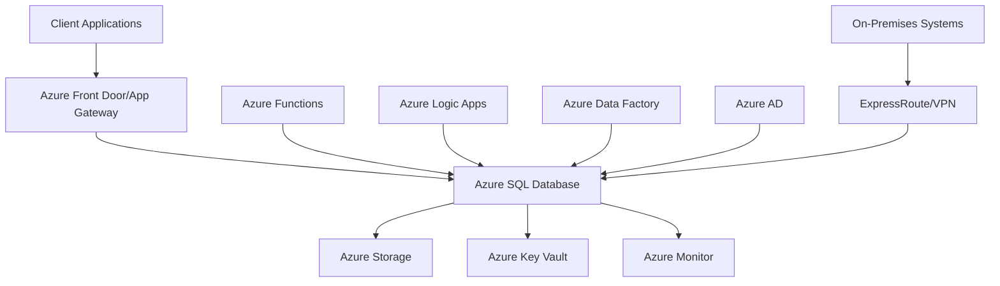

# Azure SQL Database Technical Deep-Dive Analysis

## Executive Summary

### Solution Overview

[Provide a high-level overview of the Azure SQL Database solution architecture, key components, and business value proposition]

### Key Technical Decisions

- **Database Engine Selection**: Azure SQL Database (PaaS) vs SQL Server on VMs vs SQL Managed Instance
- **Service Tier Selection**: General Purpose, Business Critical, or Hyperscale based on performance and HA requirements
- **Authentication Strategy**: Azure AD integration, SQL Server authentication, or hybrid approach
- **High Availability Configuration**: Zone redundancy, geo-redundancy, and failover strategies
- **Security Framework**: Encryption, network security, and access control implementation

### Success Metrics

- **Performance Targets**: Query response times, throughput, and concurrent user support
- **Availability SLA**: 99.99% uptime for production workloads
- **Cost Optimization**: Resource utilization and budget alignment
- **Security Compliance**: Regulatory requirements and data protection standards

## Technical Architecture

### System Context Diagram

### Database Architecture

#### Schema Design

- **Normalization Strategy**: [Define normalization level (3NF, BCNF) and denormalization for performance]
- **Indexing Strategy**: Clustered/non-clustered indexes, columnstore indexes, and full-text indexes
- **Partitioning Strategy**: Horizontal partitioning for large tables and performance optimization
- **Constraints and Triggers**: Primary keys, foreign keys, check constraints, and business rule enforcement

#### Data Types and Storage

- **Column Data Types**: Optimized data types for storage efficiency and query performance
- **Computed Columns**: Calculated fields for derived data and indexing
- **Sparse Columns**: Storage optimization for columns with many NULL values
- **File/Table Compression**: Row compression, page compression, and columnstore compression

### Security Architecture

#### Authentication and Authorization

- **Azure AD Integration**: Seamless authentication with Azure Active Directory
- **Role-Based Access Control**: Database roles, application roles, and user-defined roles
- **Row-Level Security**: Fine-grained access control at the row level
- **Dynamic Data Masking**: Real-time data masking for sensitive information

#### Data Protection

- **Transparent Data Encryption (TDE)**: Encryption at rest using Azure Key Vault
- **Always Encrypted**: Client-side encryption for sensitive data
- **Backup Encryption**: Encrypted backups with customer-managed keys
- **Network Security**: Private endpoints, VNet integration, and firewall rules

### High Availability and Disaster Recovery

#### Availability Configuration

- **Service Tiers**: General Purpose (local HA), Business Critical (zone redundancy), Hyperscale (high scalability)
- **Read Replicas**: Read-only replicas for read scaling and HA
- **Auto-Failover Groups**: Automatic failover to secondary region
- **Zone Redundancy**: Data replication across availability zones

#### Disaster Recovery Strategy

- **Geo-Redundancy**: Cross-region replication for disaster recovery
- **Backup Strategy**: Automated backups with configurable retention periods
- **Point-in-Time Restore**: Recovery to any point within retention period
- **Failover Testing**: Regular DR drills and failover testing procedures

## Integration Architecture

### Application Integration Patterns

#### Connection Management

- **Connection Pooling**: Efficient connection reuse and resource management
- **Connection Retry Logic**: Transient fault handling and connection resilience
- **Connection Timeouts**: Appropriate timeout settings for different operations
- **Connection Monitoring**: Connection pool monitoring and performance tracking

#### Data Access Patterns

- **Entity Framework**: ORM integration and LINQ query optimization
- **ADO.NET**: Direct SQL access with parameterized queries and stored procedures
- **Dapper**: Lightweight ORM for high-performance data access
- **Custom Data Access Layer**: Application-specific data access abstractions

### System Integration

#### ETL/ELT Integration

- **Azure Data Factory**: Data pipelines for batch processing and ETL operations
- **Azure Synapse Analytics**: Data warehousing and big data analytics integration
- **Azure Databricks**: Advanced analytics and machine learning integration
- **Third-Party ETL Tools**: SSIS, Informatica, and other ETL platform integration

#### Real-Time Integration

- **Change Data Capture**: Real-time data synchronization and event streaming
- **Azure Event Hubs**: High-throughput event ingestion and processing
- **Azure Service Bus**: Reliable messaging and queue-based integration
- **Azure Functions**: Serverless compute for event-driven processing

## Performance Architecture

### Query Optimization

#### Index Design

- **Clustered Indexes**: Primary key and frequently queried columns
- **Non-Clustered Indexes**: Foreign keys, filtered indexes, and covering indexes
- **Columnstore Indexes**: Analytical workloads and data compression
- **Index Maintenance**: Automated index rebuilds and reorganization

#### Query Performance

- **Execution Plan Analysis**: Query optimization and performance tuning
- **Statistics Management**: Automated statistics updates and histogram maintenance
- **Query Store**: Performance monitoring and regression detection
- **Automatic Tuning**: Automatic plan correction and index recommendations

### Scalability Considerations

#### Vertical Scaling

- **Service Tier Upgrades**: Scaling compute resources (vCores, memory)
- **Storage Scaling**: Increasing storage capacity and IOPS
- **Performance Tier Adjustments**: Dynamic performance scaling based on workload

#### Horizontal Scaling

- **Read Scale-Out**: Read-only replicas for read-heavy workloads
- **Database Sharding**: Horizontal partitioning across multiple databases
- **Federation Patterns**: Distributed database design for massive scale

### Resource Optimization

#### Workload Management

- **Resource Governor**: Resource allocation and workload prioritization
- **Query Performance Insights**: Performance monitoring and bottleneck identification
- **Workload Classification**: Workload grouping and resource allocation
- **Performance Baselines**: Establishing performance benchmarks and thresholds

## Monitoring and Observability

### Azure Monitor Integration

#### Metrics Collection

- **Database Metrics**: CPU, memory, storage, and IOPS utilization
- **Query Performance**: Execution times, wait statistics, and deadlock monitoring
- **Connection Metrics**: Connection counts, pool utilization, and failed connections
- **Error Monitoring**: Failed queries, timeout errors, and exception tracking

#### Alerting Configuration

- **Performance Alerts**: CPU/memory thresholds and performance degradation
- **Availability Alerts**: Service outages and connectivity issues
- **Security Alerts**: Failed login attempts and suspicious activities
- **Capacity Alerts**: Storage utilization and resource exhaustion warnings

### Logging and Diagnostics

#### Audit Logging

- **SQL Audit**: Database-level auditing for security and compliance
- **Azure Activity Logs**: Control plane operations and configuration changes
- **Diagnostic Logs**: Detailed logging for troubleshooting and analysis
- **Custom Logging**: Application-specific logging and telemetry

#### Performance Diagnostics

- **Query Store**: Historical query performance and plan analysis
- **Extended Events**: Detailed event collection for advanced troubleshooting
- **Dynamic Management Views**: Real-time performance and system state monitoring
- **Azure Advisor**: Automated recommendations for performance optimization

## Security Implementation

### Identity and Access Management

#### Authentication Methods

- **Azure AD Authentication**: Integrated authentication with Azure Active Directory
- **SQL Server Authentication**: Traditional username/password authentication
- **Azure AD Service Principals**: Application authentication for automated processes
- **Multi-Factor Authentication**: Enhanced security for privileged accounts

#### Authorization Model

- **Server-Level Roles**: Server administration and management roles
- **Database-Level Roles**: Database access and permission management
- **Application Roles**: Application-specific permission sets
- **Custom Roles**: User-defined roles for specific business requirements

### Data Security Controls

#### Encryption Implementation

- **TDE Configuration**: Transparent data encryption setup and key management
- **Always Encrypted Setup**: Column-level encryption for sensitive data
- **Backup Encryption**: Encrypted backup files with customer-managed keys
- **Connection Encryption**: SSL/TLS encryption for data in transit

#### Network Security

- **Virtual Network Integration**: Private endpoint and VNet integration
- **Firewall Rules**: IP-based access control and connection restrictions
- **Private Link**: Private connectivity without public internet exposure
- **Network Security Groups**: Network-level access control and segmentation

## Deployment and Operations

### Infrastructure as Code

#### ARM Templates

- **Database Deployment**: Automated database provisioning and configuration
- **Network Setup**: VNet, subnets, and network security configuration
- **Security Configuration**: Key Vault, access policies, and encryption setup
- **Monitoring Setup**: Azure Monitor, alerts, and diagnostic settings

#### CI/CD Integration

- **Database Migrations**: Automated schema deployments and data migrations
- **Configuration Management**: Environment-specific configuration and secrets
- **Testing Automation**: Automated testing for database changes
- **Rollback Procedures**: Automated rollback for failed deployments

### Operational Procedures

#### Maintenance Operations

- **Index Maintenance**: Automated index rebuilds and statistics updates
- **Backup Operations**: Automated backup scheduling and retention management
- **Patching Strategy**: Automated patching for security updates and bug fixes
- **Performance Tuning**: Regular performance monitoring and optimization

#### Incident Response

- **Monitoring Dashboards**: Real-time monitoring and alerting dashboards
- **Runbooks**: Automated response procedures for common incidents
- **Escalation Procedures**: Incident escalation and communication protocols
- **Post-Mortem Analysis**: Incident review and preventive measure implementation

## Backup and Recovery

### Backup Strategy

#### Automated Backups

- **Full Backups**: Weekly full database backups with retention policies
- **Differential Backups**: Daily differential backups for faster recovery
- **Transaction Log Backups**: Hourly log backups for point-in-time recovery
- **Backup Storage**: Geo-redundant storage with encryption and access controls

#### Backup Validation

- **Backup Integrity Checks**: Automated backup verification and corruption detection
- **Restore Testing**: Regular restore testing to validate backup recoverability
- **Backup Monitoring**: Backup success/failure monitoring and alerting
- **Retention Compliance**: Backup retention policies aligned with regulatory requirements

### Recovery Procedures

#### Point-in-Time Recovery

- **Recovery Time Objectives**: Defined RTO for different recovery scenarios
- **Recovery Point Objectives**: Maximum acceptable data loss tolerance
- **Recovery Testing**: Regular DR testing and recovery procedure validation
- **Business Continuity**: Minimal downtime procedures and communication plans

## Cost Optimization

### Resource Sizing

#### Performance vs Cost Balance

- **Right-Sizing**: Appropriate service tier selection based on workload requirements
- **Reserved Instances**: Cost optimization through reserved capacity commitments
- **Auto-Scaling**: Dynamic scaling based on workload patterns
- **Resource Monitoring**: Continuous monitoring for over/under-provisioning

#### Cost Monitoring

- **Azure Cost Management**: Cost tracking and budget monitoring
- **Resource Utilization**: CPU, memory, and storage utilization analysis
- **Performance per Cost**: Cost efficiency metrics and optimization opportunities
- **Cost Allocation**: Cost tagging and chargeback mechanisms

### Optimization Strategies

#### Storage Optimization

- **Compression**: Data compression for storage cost reduction
- **Archiving**: Data archiving strategies for long-term retention
- **Tiering**: Hot/warm/cold data tiering for cost optimization
- **Cleanup**: Automated cleanup of temporary and obsolete data

## Compliance and Governance

### Regulatory Compliance

#### Data Privacy

- **GDPR Compliance**: Data subject rights and privacy protection measures
- **CCPA Compliance**: California Consumer Privacy Act requirements
- **Industry Standards**: HIPAA, SOX, and other industry-specific regulations
- **Data Classification**: Data sensitivity classification and handling procedures

#### Audit and Reporting

- **Audit Logs**: Comprehensive audit trails for compliance reporting
- **Access Reviews**: Regular access permission reviews and certifications
- **Compliance Monitoring**: Automated compliance monitoring and reporting
- **Documentation**: Compliance documentation and evidence collection

### Governance Framework

#### Change Management

- **Change Approval**: Database change approval and review processes
- **Version Control**: Schema versioning and change tracking
- **Testing Requirements**: Testing requirements for database changes
- **Rollback Planning**: Change rollback procedures and risk mitigation

## Migration Strategy

### Assessment and Planning

#### Current State Analysis

- **Database Inventory**: Current database landscape and dependencies
- **Application Assessment**: Application compatibility and migration requirements
- **Performance Baseline**: Current performance metrics and requirements
- **Security Assessment**: Current security posture and compliance status

#### Migration Planning

- **Migration Approach**: Big bang, phased, or hybrid migration strategies
- **Data Migration Tools**: Azure Database Migration Service and third-party tools
- **Application Migration**: Application code changes and compatibility updates
- **Testing Strategy**: Migration testing and validation procedures

### Implementation Phases

#### Phase 1: Preparation

- **Environment Setup**: Target environment provisioning and configuration
- **Schema Migration**: Database schema migration and validation
- **Security Setup**: Security configuration and access control setup
- **Network Configuration**: Network connectivity and security configuration

#### Phase 2: Migration

- **Data Migration**: Data migration with minimal downtime strategies
- **Application Updates**: Application configuration updates and testing
- **Performance Validation**: Performance testing and optimization
- **Failover Testing**: Failover procedures and business continuity testing

#### Phase 3: Optimization

- **Performance Tuning**: Post-migration performance optimization
- **Cost Optimization**: Resource optimization and cost management
- **Monitoring Setup**: Comprehensive monitoring and alerting configuration
- **Documentation**: Migration documentation and knowledge transfer

## Future Considerations

### Scalability Roadmap

#### Short-Term Growth

- **Capacity Planning**: 6-12 month capacity requirements and scaling plans
- **Performance Optimization**: Query optimization and indexing improvements
- **Monitoring Enhancements**: Advanced monitoring and analytics capabilities
- **Automation**: Operational automation and self-service capabilities

#### Long-Term Evolution

- **Architecture Evolution**: Migration to microservices or serverless architectures
- **Technology Updates**: Adoption of new Azure SQL Database features and capabilities
- **Data Strategy**: Data lake integration and advanced analytics capabilities
- **Cloud-Native Transformation**: Full cloud-native architecture adoption

### Technology Roadmap

#### Feature Adoption

- **Azure Synapse Link**: Real-time analytics and HTAP capabilities
- **Intelligent Performance**: AI-powered performance recommendations and automation
- **Advanced Security**: Enhanced security features and threat protection
- **Serverless Computing**: Serverless SQL Database for variable workloads

#### Integration Enhancements

- **Event-Driven Architecture**: Event-driven data processing and real-time integration
- **AI/ML Integration**: Machine learning capabilities and predictive analytics
- **IoT Integration**: IoT data ingestion and processing capabilities
- **Multi-Cloud Strategy**: Multi-cloud data management and portability

### Operational Excellence

#### Automation and DevOps

- **Infrastructure Automation**: Complete infrastructure as code and automation
- **CI/CD Maturity**: Advanced deployment pipelines and release management
- **Observability**: Comprehensive observability and monitoring capabilities
- **Site Reliability Engineering**: SRE practices and reliability engineering

#### Team Development

- **Skills Development**: Team training and certification programs
- **Knowledge Management**: Documentation and knowledge sharing platforms
- **Collaboration Tools**: Enhanced collaboration and communication tools
- **Continuous Learning**: Ongoing learning and improvement programs

## Risk Mitigation

### Technical Risks

#### Performance Risks

- **Query Performance Degradation**: Implement Query Store and automatic tuning
- **Resource Contention**: Monitor resource utilization and implement workload management
- **Scalability Limitations**: Design for horizontal scaling and implement sharding strategies
- **Storage Performance**: Optimize storage configuration and implement data compression

#### Security Risks

- **Data Breach Prevention**: Implement comprehensive encryption and access controls
- **Compliance Violations**: Regular compliance audits and automated monitoring
- **Configuration Drift**: Infrastructure as code and configuration management
- **Insider Threats**: Least privilege access and audit logging

### Operational Risks

#### Availability Risks

- **Service Outages**: Implement high availability configurations and failover strategies
- **Data Loss Prevention**: Comprehensive backup and disaster recovery procedures
- **Performance Degradation**: Proactive monitoring and performance optimization
- **Incident Response**: Defined incident response procedures and communication plans

#### Cost Risks

- **Cost Overruns**: Cost monitoring and budget controls
- **Resource Waste**: Resource optimization and auto-scaling
- **Unexpected Charges**: Cost analysis and optimization recommendations
- **Budget Management**: Cost allocation and chargeback mechanisms

## Success Metrics and KPIs

### Performance Metrics

- **Query Response Time**: P95 < 100ms for OLTP queries, < 1s for complex queries
- **Throughput**: 1000+ transactions per second sustained
- **Concurrent Users**: Support for 1000+ concurrent connections
- **Availability**: 99.99% uptime for production workloads

### Operational Metrics

- **MTTR (Mean Time to Recovery)**: < 15 minutes for critical incidents
- **Backup Success Rate**: 100% successful backups
- **Security Incidents**: Zero data breaches or security incidents
- **Compliance Score**: 100% compliance with regulatory requirements

### Business Metrics

- **User Satisfaction**: > 95% user satisfaction with application performance
- **Cost per Transaction**: Optimized cost per database transaction
- **Time to Market**: Reduced time for new feature deployments
- **Business Continuity**: Zero business disruption due to database issues

## Conclusion

### Key Achievements

[Summarize the successful implementation of Azure SQL Database solution and achieved benefits]

### Lessons Learned

[Document key lessons learned during the implementation and operational phases]

### Next Steps

[Outline immediate next steps and long-term roadmap for the solution evolution]

### Recommendations

[Provide final recommendations for ongoing optimization and future enhancements]
