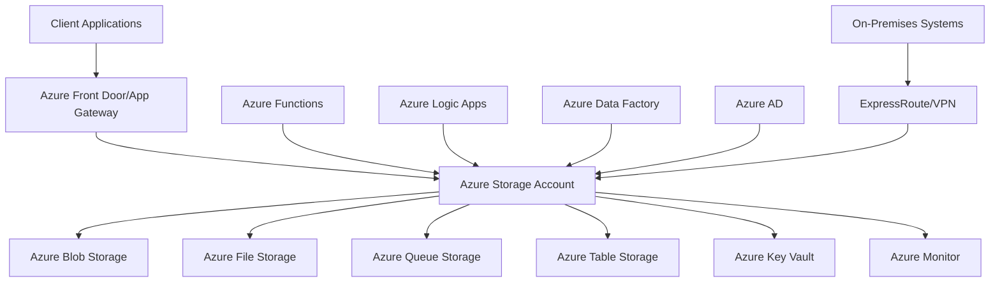

# Azure Storage Technical Deep-Dive Analysis

## Executive Summary

### Solution Overview

[Provide a high-level overview of the Azure Storage solution architecture, key components, and business value proposition]

### Key Technical Decisions

- **Storage Account Types**: General-purpose v2, Blob storage, or File storage accounts
- **Redundancy Options**: Locally redundant, zone redundant, geo-redundant, or geo-zone redundant storage
- **Access Tiers**: Hot, cool, or archive tiers based on access patterns and cost requirements
- **Security Framework**: Encryption, network security, and access control implementation
- **Integration Strategy**: REST APIs, SDKs, and protocol support (SMB, NFS, REST)

### Success Metrics

- **Performance Targets**: Throughput, latency, and concurrent connection support
- **Durability SLA**: 99.999999999% (11 nines) durability for stored data
- **Cost Optimization**: Storage utilization and budget alignment
- **Security Compliance**: Regulatory requirements and data protection standards

## Technical Architecture

### System Context Diagram

### Storage Architecture

#### Account Design

- **Storage Account Types**: General-purpose v2 for comprehensive storage services
- **Namespace Design**: Hierarchical namespace for blob storage optimization
- **Access Patterns**: Hot path optimization for frequently accessed data
- **Multi-Region Strategy**: Geo-redundancy for disaster recovery and compliance

#### Service-Specific Architecture

- **Blob Storage**: Object storage for unstructured data with tiering capabilities
- **File Storage**: Managed file shares with SMB and NFS protocol support
- **Queue Storage**: Reliable message queuing for asynchronous processing
- **Table Storage**: NoSQL key-value storage for structured data

### Security Architecture

#### Authentication and Authorization

- **Azure AD Integration**: Seamless authentication with Azure Active Directory
- **Shared Access Signatures**: Time-limited, permission-specific access tokens
- **Role-Based Access Control**: Storage roles and custom role definitions
- **Anonymous Access Control**: Public access management for blob containers

#### Data Protection

- **Storage Service Encryption**: Encryption at rest using Microsoft-managed or customer-managed keys
- **Client-Side Encryption**: Application-level encryption for sensitive data
- **HTTPS-Only Access**: Secure transport layer encryption
- **Network Security**: Private endpoints, VNet integration, and firewall rules

### High Availability and Disaster Recovery

#### Availability Configuration

- **Redundancy Levels**: LRS, ZRS, GRS, and GZRS for different availability requirements
- **Cross-Region Replication**: Asynchronous replication to secondary regions
- **Availability Zones**: Zone-redundant storage for high availability
- **Service-Level Agreements**: 99.9% to 99.999% availability based on redundancy level

#### Disaster Recovery Strategy

- **Geo-Redundancy**: Cross-region replication for disaster recovery
- **Failover Strategies**: Manual or automatic failover to secondary region
- **Data Durability**: 99.999999999% durability across all redundancy options
- **Recovery Time Objectives**: RTO considerations for different storage services

## Integration Architecture

### Application Integration Patterns

#### Connection Management

- **Connection Pooling**: Efficient connection reuse for high-throughput scenarios
- **Retry Logic**: Transient fault handling and exponential backoff
- **Connection Timeouts**: Appropriate timeout settings for different operations
- **Connection Monitoring**: Connection metrics and performance tracking

#### Data Access Patterns

- **Azure SDKs**: Language-specific SDKs for comprehensive storage operations
- **REST APIs**: Direct REST API access for custom integrations
- **Azure Storage Explorer**: GUI-based storage management and data browsing
- **AzCopy/AzCopy**: High-performance data transfer utilities

### System Integration

#### ETL/ELT Integration

- **Azure Data Factory**: Data pipelines for batch processing and data movement
- **Azure Synapse Analytics**: Data warehousing and analytics integration
- **Azure Databricks**: Big data processing and analytics workloads
- **Third-Party Tools**: Integration with existing ETL platforms and tools

#### Real-Time Integration

- **Event Grid Integration**: Event-driven processing for blob operations
- **Azure Functions**: Serverless compute for event-driven storage processing
- **Azure Logic Apps**: Workflow automation for storage operations
- **Change Notifications**: Real-time notifications for data changes

## Performance Architecture

### Storage Optimization

#### Access Tier Management

- **Hot Tier**: Frequently accessed data with low latency requirements
- **Cool Tier**: Infrequently accessed data with cost optimization
- **Archive Tier**: Long-term retention with lowest cost
- **Lifecycle Management**: Automated tier transitions based on access patterns

#### Performance Tuning

- **Partitioning Strategy**: Optimizing partition keys for access patterns
- **Request Optimization**: Batch operations and parallel processing
- **Caching Strategies**: Azure CDN integration for global content delivery
- **Network Optimization**: Accelerated networking and proximity placement

### Scalability Considerations

#### Vertical Scaling

- **Storage Account Limits**: Understanding and managing account-level limits
- **Performance Scaling**: Increasing throughput through partitioning
- **Capacity Planning**: Forecasting storage growth and performance needs
- **Resource Optimization**: Right-sizing storage accounts and configurations

#### Horizontal Scaling

- **Multiple Storage Accounts**: Distributing load across multiple accounts
- **Geo-Distribution**: Global content delivery and regional optimization
- **Load Balancing**: Distributing requests across multiple endpoints
- **Auto-Scaling**: Dynamic scaling based on demand patterns

### Resource Optimization

#### Workload Management

- **Request Throttling**: Managing request rates and avoiding throttling
- **Bandwidth Optimization**: Compressing data and optimizing transfer sizes
- **Concurrent Connections**: Managing connection limits and pooling
- **Performance Baselines**: Establishing performance benchmarks and monitoring

## Monitoring and Observability

### Azure Monitor Integration

#### Metrics Collection

- **Storage Metrics**: Capacity, throughput, latency, and availability metrics
- **Request Metrics**: Successful/failed requests, throttling, and error rates
- **Performance Metrics**: End-to-end latency and server latency tracking
- **Capacity Metrics**: Used capacity, transaction counts, and ingress/egress data

#### Alerting Configuration

- **Performance Alerts**: Latency thresholds and throughput degradation
- **Availability Alerts**: Service outages and connectivity issues
- **Capacity Alerts**: Storage utilization and quota warnings
- **Security Alerts**: Unauthorized access attempts and suspicious activities

### Logging and Diagnostics

#### Audit Logging

- **Storage Analytics**: Detailed logging for all storage operations
- **Azure Activity Logs**: Control plane operations and configuration changes
- **Diagnostic Logs**: Detailed logging for troubleshooting and analysis
- **Custom Logging**: Application-specific logging and telemetry

#### Performance Diagnostics

- **Storage Explorer**: Visual diagnostics and performance analysis
- **Azure Advisor**: Automated recommendations for performance optimization
- **Network Monitoring**: End-to-end network performance and latency analysis
- **Application Insights**: Application-level storage performance monitoring

## Security Implementation

### Identity and Access Management

#### Authentication Methods

- **Azure AD Authentication**: Integrated authentication with Azure Active Directory
- **Shared Access Signatures**: Secure, time-limited access for applications
- **Account Keys**: Storage account access keys for service-level access
- **Azure AD Service Principals**: Application authentication for automated processes

#### Authorization Model

- **Storage Account Roles**: Built-in roles for storage account management
- **Container/File Share ACLs**: Fine-grained access control at container/share level
- **Blob/Queue/Table Permissions**: Object-level permissions and access policies
- **Custom Roles**: User-defined roles for specific business requirements

### Data Security Controls

#### Encryption Implementation

- **SSE Configuration**: Storage service encryption with Microsoft or customer-managed keys
- **Client-Side Encryption**: Application-level encryption for sensitive data
- **HTTPS Enforcement**: Mandatory secure transport for all storage operations
- **Key Management**: Azure Key Vault integration for encryption key management

#### Network Security

- **Virtual Network Integration**: Private endpoint and VNet integration
- **Firewall Rules**: IP-based access control and connection restrictions
- **Private Link**: Private connectivity without public internet exposure
- **Network Security Groups**: Network-level access control and segmentation

## Deployment and Operations

### Infrastructure as Code

#### ARM Templates

- **Storage Deployment**: Automated storage account provisioning and configuration
- **Network Setup**: VNet, subnets, and network security configuration
- **Security Configuration**: Key Vault, access policies, and encryption setup
- **Monitoring Setup**: Azure Monitor, alerts, and diagnostic settings

#### CI/CD Integration

- **Storage Configuration**: Automated configuration management and deployment
- **Security Policies**: Automated security configuration and compliance checks
- **Testing Automation**: Automated testing for storage configurations
- **Rollback Procedures**: Automated rollback for failed deployments

### Operational Procedures

#### Maintenance Operations

- **Lifecycle Management**: Automated data tiering and retention policies
- **Access Review**: Regular access permission reviews and cleanup
- **Performance Tuning**: Regular performance monitoring and optimization
- **Security Updates**: Automated security patching and updates

#### Incident Response

- **Monitoring Dashboards**: Real-time monitoring and alerting dashboards
- **Runbooks**: Automated response procedures for common incidents
- **Escalation Procedures**: Incident escalation and communication protocols
- **Post-Mortem Analysis**: Incident review and preventive measure implementation

## Backup and Recovery

### Backup Strategy

#### Backup Protection Strategies

- **Point-in-Time Snapshots**: Blob snapshots for point-in-time recovery
- **Geo-Redundancy**: Cross-region replication for disaster recovery
- **Versioning**: Blob versioning for data protection and recovery
- **Soft Delete**: Soft delete protection for accidental deletion

#### Backup Validation

- **Snapshot Integrity**: Automated snapshot verification and corruption detection
- **Replication Testing**: Regular testing of geo-replication and failover
- **Recovery Testing**: Regular restore testing to validate recoverability
- **Retention Compliance**: Backup retention policies aligned with regulatory requirements

### Recovery Procedures

#### Data Recovery

- **Point-in-Time Recovery**: Recovery to specific point using snapshots or versioning
- **Geo-Failover**: Failover to secondary region for disaster recovery
- **Deleted Data Recovery**: Recovery of soft-deleted data within retention period
- **Cross-Region Replication**: Automated replication for data durability

## Cost Optimization

### Resource Sizing

#### Performance vs Cost Balance

- **Access Tier Selection**: Appropriate tier selection based on access patterns
- **Redundancy Optimization**: Cost-effective redundancy for availability requirements
- **Storage Optimization**: Data compression and deduplication strategies
- **Reservation Planning**: Reserved capacity for predictable workloads

#### Cost Monitoring

- **Azure Cost Management**: Cost tracking and budget monitoring
- **Storage Utilization**: Capacity and transaction cost analysis
- **Performance per Cost**: Cost efficiency metrics and optimization opportunities
- **Cost Allocation**: Cost tagging and chargeback mechanisms

### Optimization Strategies

#### Cost Optimization Strategies

- **Lifecycle Policies**: Automated data movement to lower-cost tiers
- **Data Compression**: Compression for cost-effective storage
- **Archiving**: Long-term archival storage for compliance data
- **Cleanup**: Automated cleanup of temporary and obsolete data

## Compliance and Governance

### Regulatory Compliance

#### Data Privacy

- **GDPR Compliance**: Data subject rights and privacy protection measures
- **CCPA Compliance**: California Consumer Privacy Act requirements
- **Industry Standards**: HIPAA, SOX, and other industry-specific regulations
- **Data Classification**: Data sensitivity classification and handling procedures

#### Audit and Reporting

- **Audit Logs**: Comprehensive audit trails for compliance reporting
- **Access Reviews**: Regular access permission reviews and certifications
- **Compliance Monitoring**: Automated compliance monitoring and reporting
- **Documentation**: Compliance documentation and evidence collection

### Governance Framework

#### Change Management

- **Change Approval**: Storage configuration change approval and review processes
- **Version Control**: Infrastructure as code versioning and change tracking
- **Testing Requirements**: Testing requirements for storage changes
- **Rollback Planning**: Change rollback procedures and risk mitigation

## Migration Strategy

### Assessment and Planning

#### Current State Analysis

- **Storage Inventory**: Current storage landscape and data classification
- **Application Assessment**: Application compatibility and migration requirements
- **Performance Baseline**: Current performance metrics and requirements
- **Security Assessment**: Current security posture and compliance status

#### Migration Planning

- **Migration Approach**: Big bang, phased, or hybrid migration strategies
- **Data Migration Tools**: AzCopy, Azure Data Box, and third-party migration tools
- **Application Migration**: Application code changes and compatibility updates
- **Testing Strategy**: Migration testing and validation procedures

### Implementation Phases

#### Phase 1: Preparation

- **Environment Setup**: Target storage account provisioning and configuration
- **Data Classification**: Data categorization and migration prioritization
- **Security Setup**: Security configuration and access control setup
- **Network Configuration**: Network connectivity and security configuration

#### Phase 2: Migration

- **Data Migration**: Data migration with minimal downtime strategies
- **Application Updates**: Application configuration updates and testing
- **Performance Validation**: Performance testing and optimization
- **Failover Testing**: Failover procedures and business continuity testing

#### Phase 3: Optimization

- **Performance Tuning**: Post-migration performance optimization
- **Cost Optimization**: Resource optimization and cost management
- **Monitoring Setup**: Comprehensive monitoring and alerting configuration
- **Documentation**: Migration documentation and knowledge transfer

## Future Considerations

### Scalability Roadmap

#### Short-Term Growth

- **Capacity Planning**: 6-12 month capacity requirements and scaling plans
- **Performance Optimization**: Access pattern optimization and caching improvements
- **Monitoring Enhancements**: Advanced monitoring and analytics capabilities
- **Automation**: Operational automation and self-service capabilities

#### Long-Term Evolution

- **Architecture Evolution**: Migration to data lake or modern data architecture
- **Technology Updates**: Adoption of new Azure Storage features and capabilities
- **AI/ML Integration**: AI-powered storage optimization and analytics
- **Multi-Cloud Strategy**: Multi-cloud storage management and portability

### Technology Roadmap

#### Feature Adoption

- **Data Lake Storage**: Hierarchical namespace and analytics capabilities
- **Intelligent Tiering**: AI-powered automatic tiering and optimization
- **Advanced Security**: Enhanced security features and threat protection
- **Serverless Integration**: Serverless compute integration with storage events

#### Integration Enhancements

- **Event-Driven Architecture**: Event-driven data processing and real-time integration
- **IoT Integration**: IoT data ingestion and processing capabilities
- **Edge Computing**: Azure Stack Edge integration for edge storage
- **Blockchain Integration**: Immutable storage for blockchain and audit trails

### Operational Excellence

#### Automation and DevOps

- **Infrastructure Automation**: Complete infrastructure as code and automation
- **CI/CD Maturity**: Advanced deployment pipelines and release management
- **Observability**: Comprehensive observability and monitoring capabilities
- **Site Reliability Engineering**: SRE practices and reliability engineering

#### Team Development

- **Skills Development**: Team training and certification programs
- **Knowledge Management**: Documentation and knowledge sharing platforms
- **Collaboration Tools**: Enhanced collaboration and communication tools
- **Continuous Learning**: Ongoing learning and improvement programs

## Risk Mitigation

### Technical Risks

#### Performance Risks

- **Access Latency**: Implement CDN and caching strategies for global performance
- **Throttling Issues**: Monitor request rates and implement retry logic
- **Scalability Limitations**: Design for horizontal scaling and account partitioning
- **Network Performance**: Optimize network configuration and proximity placement

#### Security Risks

- **Data Breach Prevention**: Implement comprehensive encryption and access controls
- **Compliance Violations**: Regular compliance audits and automated monitoring
- **Configuration Drift**: Infrastructure as code and configuration management
- **Insider Threats**: Least privilege access and audit logging

### Operational Risks

#### Availability Risks

- **Service Outages**: Implement geo-redundancy and failover strategies
- **Data Loss Prevention**: Comprehensive backup and disaster recovery procedures
- **Performance Degradation**: Proactive monitoring and performance optimization
- **Incident Response**: Defined incident response procedures and communication plans

#### Cost Risks

- **Cost Overruns**: Cost monitoring and budget controls
- **Resource Waste**: Resource optimization and lifecycle management
- **Unexpected Charges**: Cost analysis and optimization recommendations
- **Budget Management**: Cost allocation and chargeback mechanisms

## Success Metrics and KPIs

### Performance Metrics

- **Throughput**: Up to 5000 MB/s per storage account for large operations
- **Latency**: P95 < 10ms for hot tier, < 100ms for cool/archive tiers
- **Concurrent Connections**: Support for 1000+ concurrent connections
- **Availability**: 99.9% for LRS, 99.99% for ZRS/GRS, 99.999% for GZRS

### Operational Metrics

- **MTTR (Mean Time to Recovery)**: < 15 minutes for critical incidents
- **Data Durability**: 99.999999999% durability across all storage types
- **Security Incidents**: Zero data breaches or security incidents
- **Compliance Score**: 100% compliance with regulatory requirements

### Business Metrics

- **User Satisfaction**: > 95% user satisfaction with storage performance
- **Cost per GB**: Optimized cost per gigabyte stored
- **Time to Market**: Reduced time for new storage-dependent features
- **Business Continuity**: Zero business disruption due to storage issues

## Conclusion

### Key Achievements

[Summarize the successful implementation of Azure Storage solution and achieved benefits]

### Lessons Learned

[Document key lessons learned during the implementation and operational phases]

### Next Steps

[Outline immediate next steps and long-term roadmap for the solution evolution]

### Recommendations

[Provide final recommendations for ongoing optimization and future enhancements]
